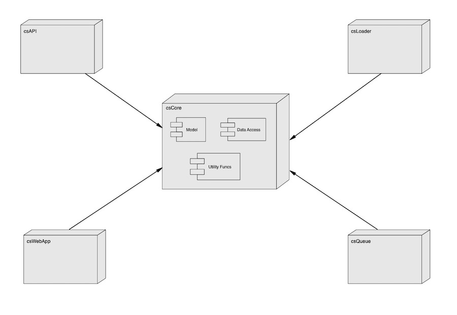

# Common Stocks

## Introduction

The purpose of this application is to allow users to perform fundamental analysis and valuations on publicly quoted 
companies that are included in the S&P 600, 400 and 500 indexes.  The application offers the following features:
- Compay details: description, address, classification and identifiers such as CIK and FIGI
- Financial statements: Key figures from income, balance sheet and earnings
- Financial ration analysis
- Valuation using discounded cash flow (DCF)
- Competitor comparison
- Projected growth and price range calculations
- A web front in for user interaction
- A RESTful service for data access

## Constraints

This application uses financial data from the [Aphavantage website](https://www.alphavantage.co/).  The freely available
key provided by this site comes with a number of restrictions:
- Limited to 5 API calls per minute
- A maximum of 500 API calls per day

To work within these limitations the application caches downoaded for a given time period and uses a message que to aid
responsiveness in downloading the company data.

## System Overview

The initial version of the application consists of the following components:

**WebServer:** The webserve provides public access to the application and is responsible for routing requests to the 
web serivce or the data API service.

**csWebApp:** This application is responsible for delivering the application's UI.

**csApi:** The application is responsible for delivering the data service.

**Database Server:** All the application's data is stored in a MongoDB instance.

**csLoader:** The loader is responsible for building the list of S&P index components and loading seed data into the
database.

**Message Queue:** The message queue is used to handle requests to download company data from the Alphavantage website
if not already available in the application's database.  And for logging messages from the two web based services.

**csQueue:** The processor handles the messages posted to the message queue.

Future versions of the system will be containerized and deployed using Docker.

## Application Structure

The application has five main components, four applications and library of common code:

**csAPI:** This service uses the FastAPI framework to deliver the application's data to the public

**csWebApp:** This service uses the Flask framework to deliver the application's UI, so that the public can make use
of the application's features.

**csLoader:** This application is responsible for building the list of S&P index components and loading seed data into 
the database.

**csQueue:** The processor handles the messages posted to the message queue.

**csCore:** This is a shared code library used by the other components.  It covers such features as:
- Data Transfer Objects (DTO) used to move data around the application
- Data repository classes for accessing the database
- Common utility functions
- And so on

## Documentation

The majority of the documentation is stored in the design folder and consists of the following documents:

| Document                              | Description                                              |
|---------------------------------------|----------------------------------------------------------|
| [Database Design](design/database.md) | This document covers both the application and log tables |

## Deployment

The deployment documentaiton can be found in the deployment folder and consists of the following documents:

| Document | Description |
|----------|-------------|