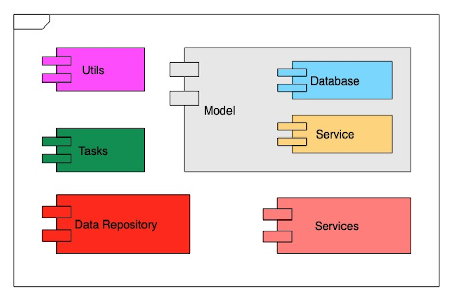

# Codebase

# Introduction

The codebase is broken down into five software projects.

## csAPI

## csWebApp

## csLoader

## csQueue

## csCore

csCore is the heart of the application, it contains all the code needed to implement the main features of the system. It 
is implemented as a library which can be imported into the other four applications.  The main components in the library 
cover the following:

- A set of DTO classes used to move data between the database, the services and the rest of the application.
- The classes and functions needed to download the external data from the data services
- A set of classes provided access to the database
- A set of Luigi tasks used to process the downloaded data and set up the data for use in the application
- Common utility functions used throughout the application

## Third Party Library

The application uses the following external libraries:

| Library                                    | Comments                                    |
|--------------------------------------------|---------------------------------------------|
| [attrs](https://www.attrs.org/en/stable/)  | Used to build DTO classes                   |
| [pendulum](https://pendulum.eustace.io/)   | Date and time support library               |
| [orjson](https://github.com/ijl/orjson)    | Faster replacement for the standard library |
