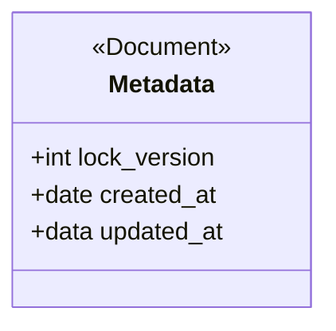
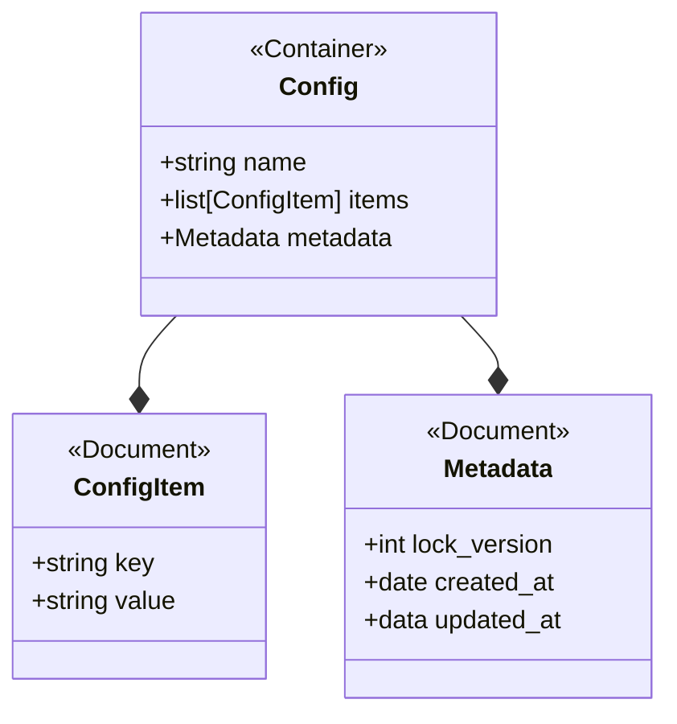
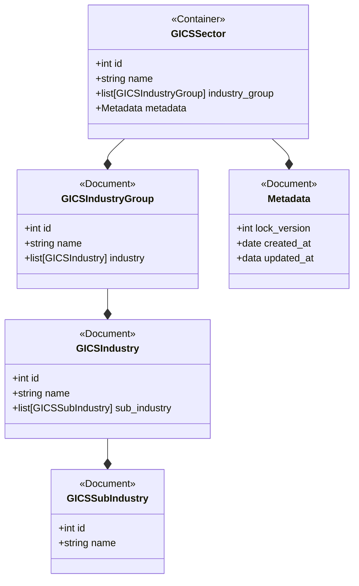
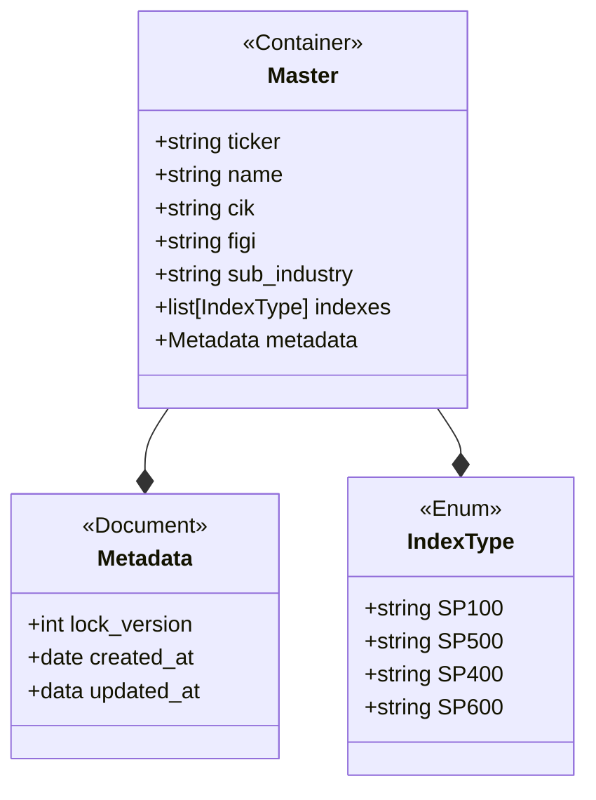
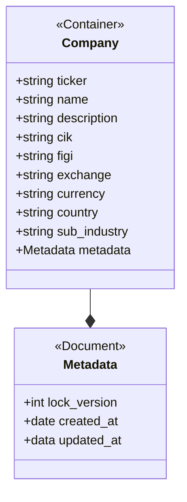
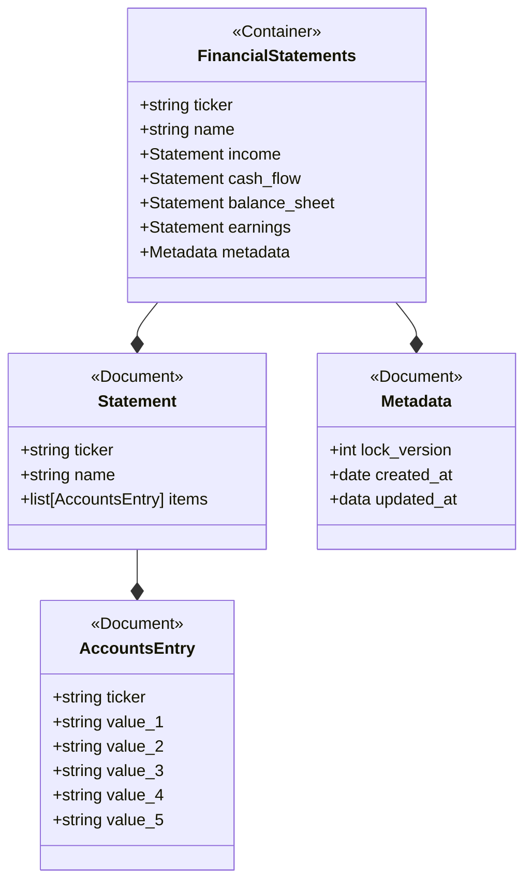
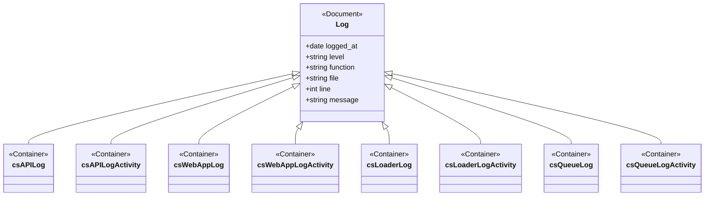

# Database Design

## Introduction

The application's data is stored in an instance of MongoDB.  The database contains a set of documents covering the 
following areas:
- Configuration
- Application 
- Logging

## Metadata

Each document in the database has a sub-document containing the following information about the document:

| Field        | Description                                 |
|--------------|---------------------------------------------|
| lock_version | concurrency flag                            | 
| created_at   | Date and time the document was created      |
| updated_at   | Date and time the document was last updated |

## Configuration

All the configuration data is stored in a singel document collection.  Each document consists of a name or key used to 
indicate the configuration information stored in the document plus an array of key/value pairs containing the 
configuration information.

## Application

This section covers the main collections in the database - the core collections used to provide the application's 
functionality.

### GICS Sector

The Global Industry Classification Standard is an industry taxonomy developed in 1999 by MSCI and Standard & Poor's 
for use by the global financial community. The GICS structure consists of 11 sectors, 24 industry groups, 69 industries 
and 158 sub-industries into which S&P has categorized all major public companies

The GICS structure consits of four elements the lowest being a sub-industry and the highest being a sector.  The 
structure is stored in the database as collection of documents at the sector level.

### Master

The master collection is used to allow users search for the company they wish to work with.  The list is limited to the
components of the S&P 600, 400 and 500 indexes.  It provides basic information about each compay in the indexes.

| Field        | Description                             |
|--------------|-----------------------------------------|
| ticker       | The stock market ticker for the company | 
| name         | The company name                        |
| cik          | The SEC code used for filing documents  |
| figi         | The Open FIGI code for the company      |
| sub_industry | The GICS classification for the company |

### Company

This collection contains detailed informaton about public company as provided by the Alphavantage data service:

| Field        | Description                                         |
|--------------|-----------------------------------------------------|
| ticker       | The stock market ticker for the company             | 
| name         | The company name                                    |
| description  | A description of the company's business activities  |
| cik          | The SEC code used for filing documents              |
| figi         | The Open FIGI code for the company                  |
| exchange     | The main stock exchange where the company is traded |
| currency     | The company's reporting currency                    |
| country      | The country where the company is head quartered     |
| sub_industry | The GICS classification for the company             |

### Financials

The financial data for each company, provided by Alphavantage, covers three statements: income, cash flow and 
balance sheet and also statement of earnings.  The information is available for both annual and quarterly reports.  Each 
accounting entry is represented by a tag such as Revenue and up to five period entries for the tag.  The financials are
stored in a single document, with sub documents for each financial statement

## Logging

The logging data is stored in one of more collections per service, each table has the same structure:

## Depoloyment

A javascript scripts are provided for creating the database.  The scripts are stored in the code/database folder.  The
following scripts are provided.

| File           | Comments                                      |
|----------------|-----------------------------------------------|
| create_db.js   | Contains routines used to create the database |
| create_all.js  | Creates all three databases: Prod, Test, Dev  |
| create_prod.js | Creates the production database               |
| create_test.js | Creates the test database                     |
| create_dev.js  | Creates the dev database                      |
