# Data Services

## Introduction

The application takes its data from four sources:

**Alphavantage:** This site provides the core data for the application, including:

- Company Description
- Earnings estimates
- Financial statements: income statement, cash flow, balance sheet and earning statement

**Wikipedia:** The application limits its company data servie offering to the conponents of the S&P 600, 400 and 500 
indexes.  The application scrapes the list of comonents for each index from the corrsponding wikipedia page. 

**EDGAR/SEC:** The application uses the EDGAR website do obtain the CIK code for the company covered by the application.

A Central Index Key or CIK number is a number given to an individual, company, or foreign government by the 
United States Securities and Exchange Commission. The number is used to identify its filings in several online 
databases, including EDGAR. The numbers are up to ten digits in length.

**OpenFIGI:** The application uses the OpenFIGI website to obtain the FIGI code for the company covered by the 
application.

## Alphavantage

As mentioned above the Alphavantage provides the core data for the application.  To access this data, you will need an
API key which can be obtained on the website at this address [API Key](https://www.alphavantage.co/support/#api-key).

The key has to constaints:

- Limited to 5 calls per minute
- Limited to 500 calls per data

Commercial keys are also available, see the website for details.

### Earnings Calendar

This API returns a list of company earnings expected in the next 3, 6, or 12 months.

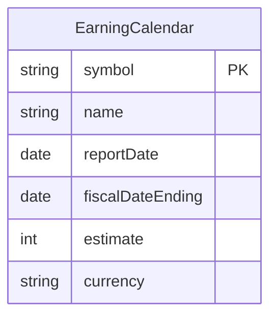

### Company Description

This API returns the company information, financial ratios, and other key metrics for the equity specified. 
Data is generally refreshed on the same day a company reports its latest earnings and financials.  We use a sub set of 
this data in the application.

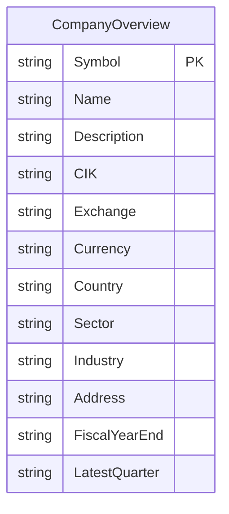

### Income Statement

This API returns the annual and quarterly income statements for the company of interest, with normalized fields mapped 
to GAAP and IFRS taxonomies of the SEC. Data is generally refreshed on the same day a company reports its latest 
earnings and financials.

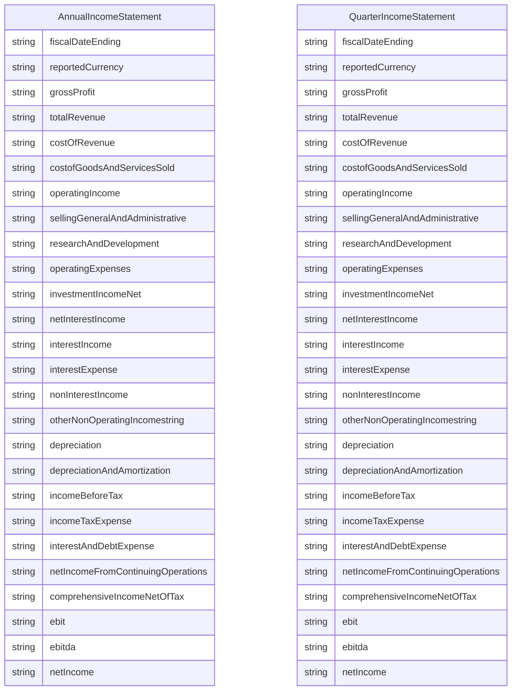
### Cash Flow Statement

This API returns the annual and quarterly cash flow for the company of interest, with normalized fields mapped to GAAP 
and IFRS taxonomies of the SEC. Data is generally refreshed on the same day a company reports its latest earnings and 
financials.

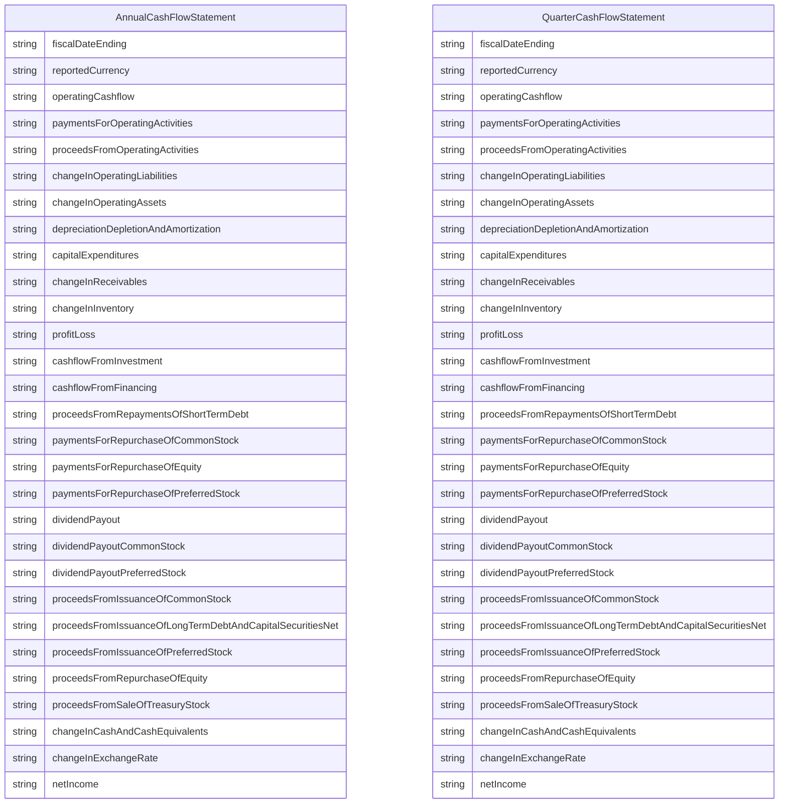

### Balance Sheet

This API returns the annual and quarterly balance sheets for the company of interest, with normalized fields mapped 
to GAAP and IFRS taxonomies of the SEC. Data is generally refreshed on the same day a company reports its latest 
earnings and financials.

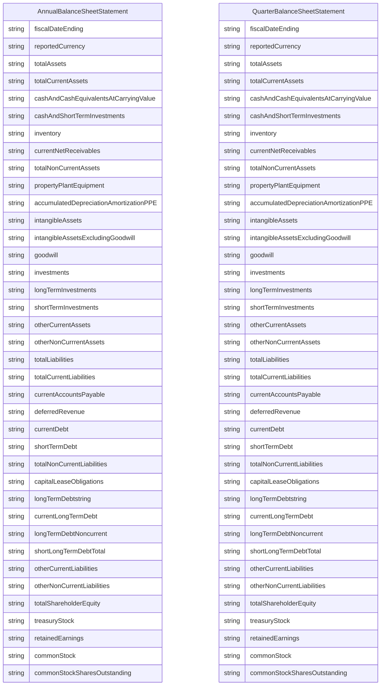

### Earnings

This API returns the annual and quarterly earnings (EPS) for the company of interest. Quarterly data also includes 
analyst estimates and surprise metrics.

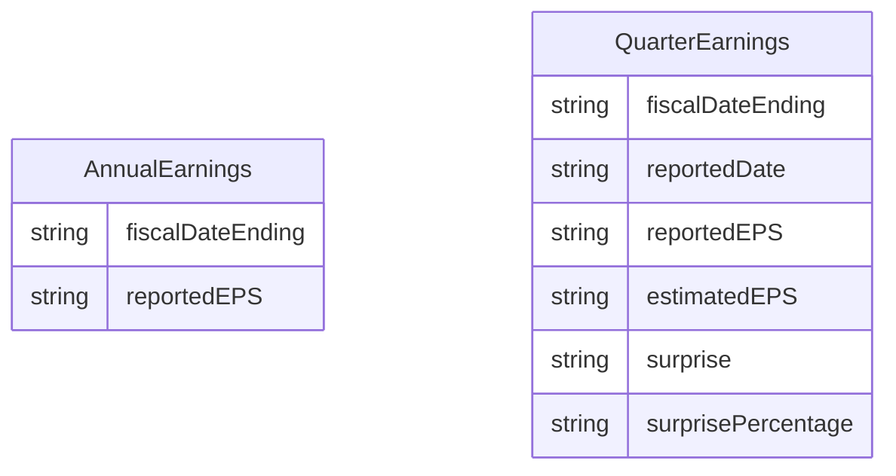

### Implementation

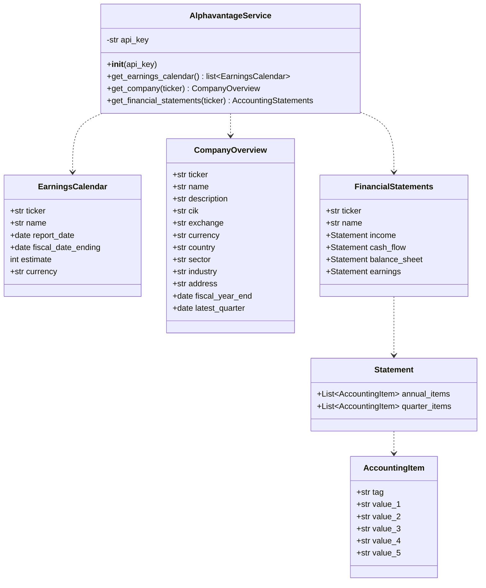

## Wikipedia

The application provides a data service for the components of the S&P 600, 400 and 500 indexes.  In additional it flags 
the components of the S&P 100, so a small data set can be used in the test and development environments.

The application uses the following urls to download the data:

| Index   | URL                                                                                                                    |
|---------|------------------------------------------------------------------------------------------------------------------------|
| S&P 100 | [https://en.wikipedia.org/wiki/S%26P_100](https://en.wikipedia.org/wiki/S%26P_100)                                     |
| S&P 600 | [https://en.wikipedia.org/wiki/List_of_S%26P_600_companies](https://en.wikipedia.org/wiki/List_of_S%26P_600_companies) |
| S&P 400 | [https://en.wikipedia.org/wiki/List_of_S%26P_400_companies](https://en.wikipedia.org/wiki/List_of_S%26P_400_companies) |
| S&P 500 | [https://en.wikipedia.org/wiki/List_of_S%26P_500_companies](https://en.wikipedia.org/wiki/List_of_S%26P_500_companies) |

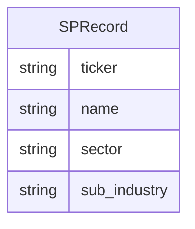

### Implementation

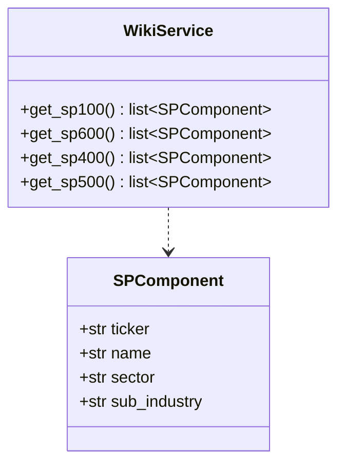

## EDGAR/SEC

The application uses the EDGAR site to look up a company's CIK code.  The information is downloaded as a single JSON 
file from the following url: [EDGAR Files](https://www.sec.gov/files/company_tickers_exchange.json).

The records have the following format:

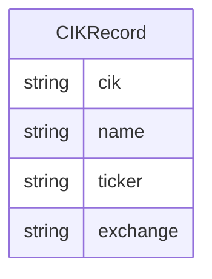

### Implementation

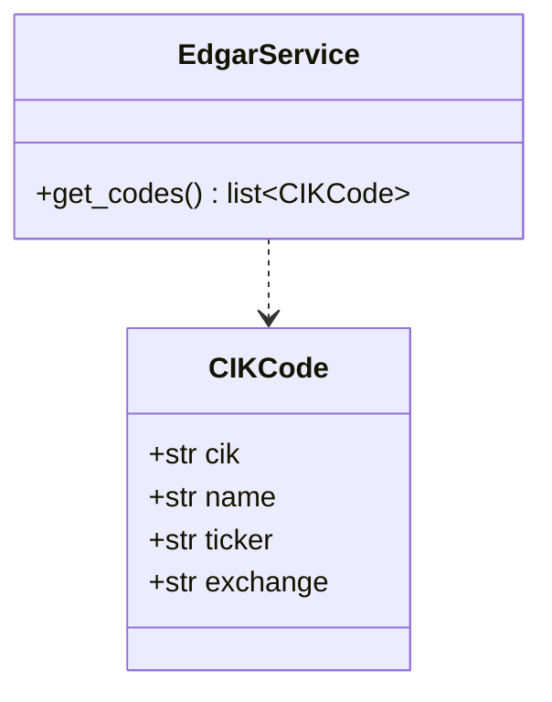

## OpenFIGI

The Financial Instrument Global Identifier (FIGI) (formerly Bloomberg Global Identifier (BBGID)) is an open standard, 
unique identifier of financial instruments that can be assigned to instrument including common stock, options, 
derivatives, futures, corporate and government bonds, municipals, currencies, and mortgage products.

The application uses the OpenFIGI website to obtain the FIGI code for the company  covered by the 
application.

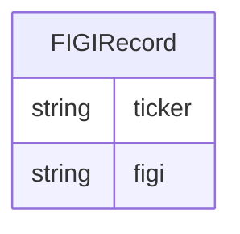

### Implementation

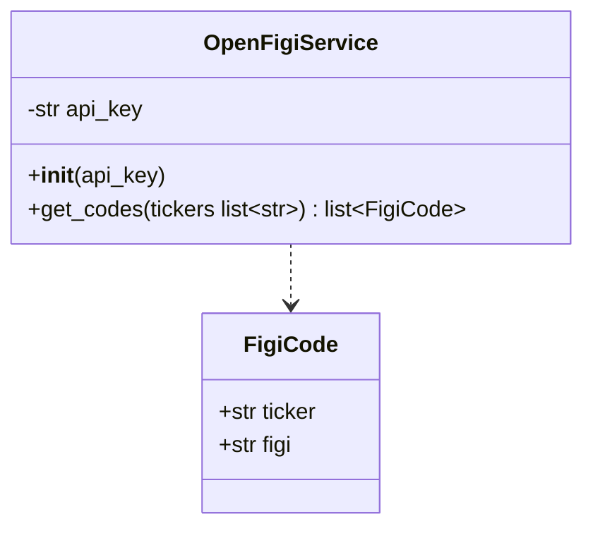
